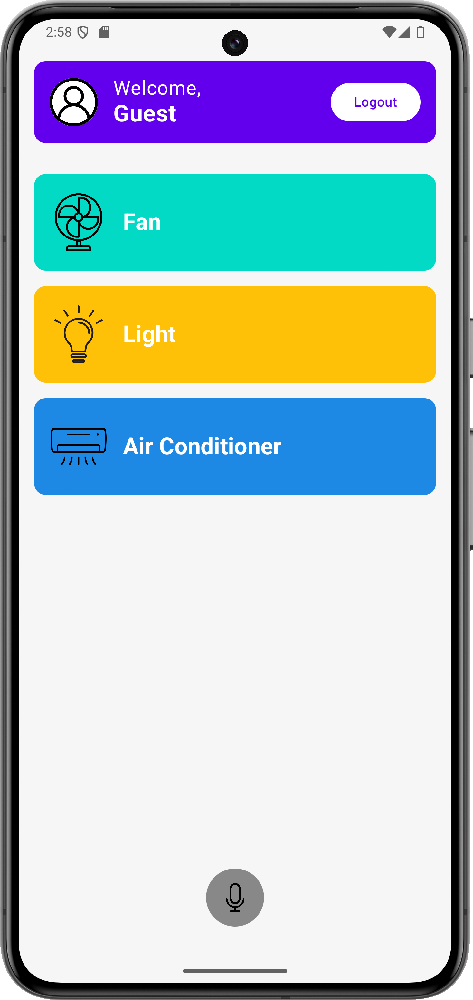
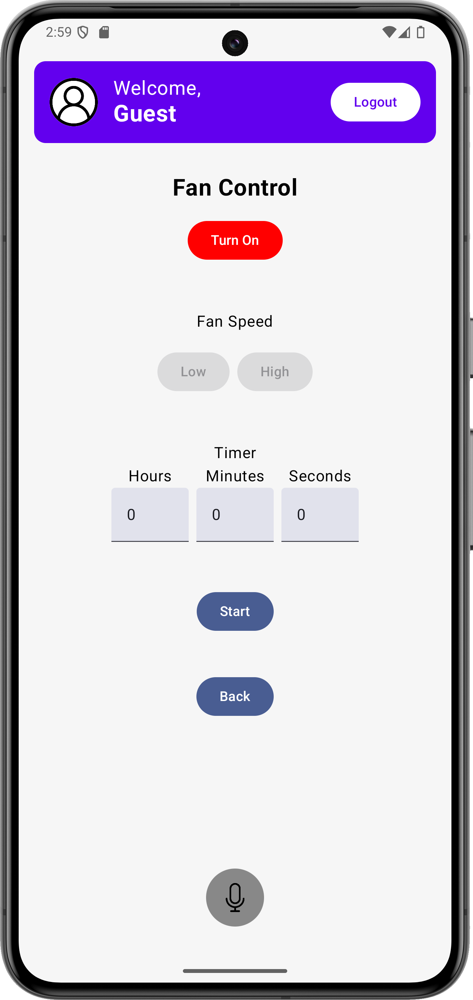
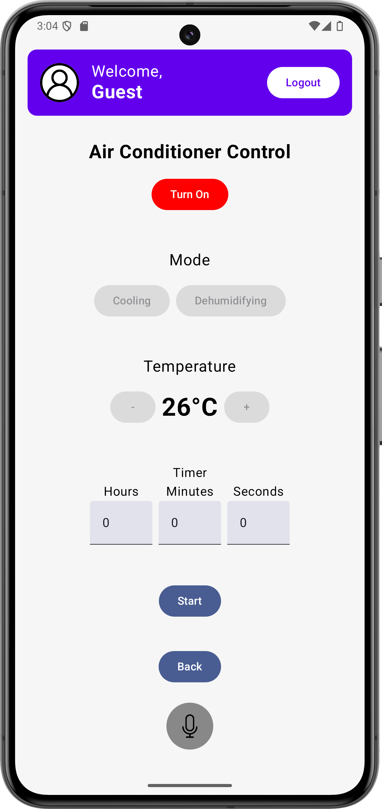

# Development-of-a-Voice-Enabled-Smart-Home-Control-System
# Project Overview

This project is my **graduation thesis**, aimed at developing a **voice-interactive smart home appliance control system**. The system simulates the control of home appliances such as fans, lights, and air conditioners through **voice commands**. It supports **real-time voice recognition** and control, and can be **remotely managed** via a mobile application.

## Key Features

- **Control of home appliances**: Manage fans, lights, and air conditioners using voice commands or manual controls.
- **Light Control**: Control lights in different rooms individually.  
- **Fan Control**: Three-speed adjustment, timer control.  
- **Air Conditioner Control**: Mode switching, temperature & airflow adjustment, real-time display.  
- **Login & Security**: Supports face recognition login.  

## Basic Workflow

1. Users **log in** (can use face recognition for login).
2. Use **voice commands** (e.g., "Turn on the fan") or **press buttons** to control the appliances.
3. Users can **set timers** to schedule when appliances should turn on or off and monitor their status.

## My Responsibilities

In this project, I was responsible for the following areas:

- **Mobile app interface design**: I designed and developed the mobile app interface for controlling appliances such as fans, lights, and air conditioners.
  
- **User authentication**:  I implemented the user login functionality, ensuring that users can securely access the app.
  
- **Facial recognition**: I used OpenCV to capture the camera feed and integrated a pre-trained model to recognize and authenticate users based on facial features, enhancing the system's security and ensuring a seamless login experience.
> (Note: Hardware integration and control with devices like the Raspberry Pi were not part of my contributions.)

## Demo Screenshots

  
  
  
  

## Demonstration Video
**Watch the full demo**: [Click here](https://youtu.be/QZ_JLb-7iHs)

